# 📋 Hướng Dẫn Quản Trị Website Minh An

> **Website:** Minh An - Cung cấp thiết bị y tế chất lượng
> **Nền tảng:** WordPress 6.9.4 + WooCommerce
> **Theme:** Custom theme "duanyu"
> **URL:** http://localhost:8080
> **Admin:** http://localhost:8080/wp-admin

---

## 📑 Mục Lục

1. [Tổng Quan Website](#1-tổng-quan-website)
2. [Header - Thanh Đầu Trang](#2-header---thanh-đầu-trang)
3. [Trang Chủ - Homepage](#3-trang-chủ---homepage)
4. [Trang Sản Phẩm - Shop](#4-trang-sản-phẩm---shop)
5. [Trang Chi Tiết Sản Phẩm](#5-trang-chi-tiết-sản-phẩm)
6. [Trang Giỏ Hàng - Cart](#6-trang-giỏ-hàng---cart)
7. [Trang Thanh Toán - Checkout](#7-trang-thanh-toán---checkout)
8. [Trang Tin Tức - Blog](#8-trang-tin-tức---blog)
9. [Footer - Chân Trang](#9-footer---chân-trang)
10. [Quản Lý Sản Phẩm](#10-quản-lý-sản-phẩm)
11. [Cài Đặt WooCommerce](#11-cài-đặt-woocommerce)
12. [Plugin Đang Sử Dụng](#12-plugin-đang-sử-dụng)

---

## 1. Tổng Quan Website

Website Minh An là trang thương mại điện tử chuyên cung cấp thiết bị y tế, sử dụng nền tảng WordPress + WooCommerce với theme tùy chỉnh.

### Cấu trúc các trang chính:

| STT | Tên trang | URL | Vai trò |
|-----|-----------|-----|---------|
| 1 | Trang chủ | `/` | Giới thiệu, banner, sản phẩm nổi bật |
| 2 | Cửa hàng | `/shop` | Danh sách tất cả sản phẩm |
| 3 | Giỏ hàng | `/cart` | Quản lý sản phẩm đã chọn mua |
| 4 | Thanh toán | `/checkout` | Form đặt hàng |
| 5 | Tin tức | `/tin-tuc` | Bài viết sức khỏe |
| 6 | Về chúng tôi | `/ve-chung-toi` | Giới thiệu công ty |
| 7 | Liên hệ | `/lien-he` | Thông tin liên lạc |
| 8 | Hệ thống cửa hàng | `/he-thong-cua-hang` | Danh sách nhà thuốc |

### Tổng Quan Admin Dashboard

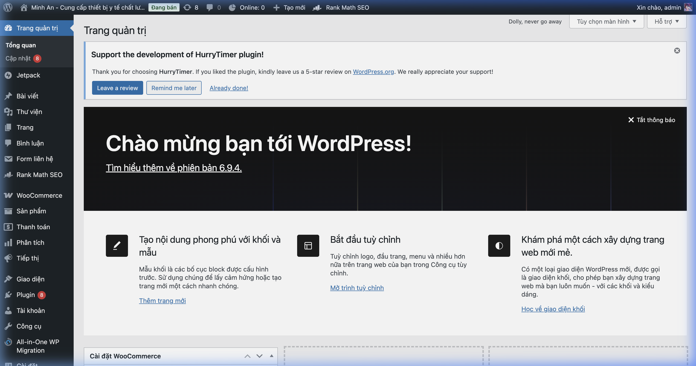

**Các mục chính trong Admin sidebar:**
- **Trang quản trị** - Dashboard tổng quan
- **Bài viết** - Quản lý blog/tin tức
- **Trang** - Quản lý các trang tĩnh
- **WooCommerce** - Quản lý đơn hàng, khách hàng, mã ưu đãi
- **Sản phẩm** - Quản lý sản phẩm, danh mục, thương hiệu
- **Giao diện** - Theme, Menu, Widget
- **Plugin** - Các tiện ích mở rộng

---

## 2. Header - Thanh Đầu Trang

### Giao diện Frontend

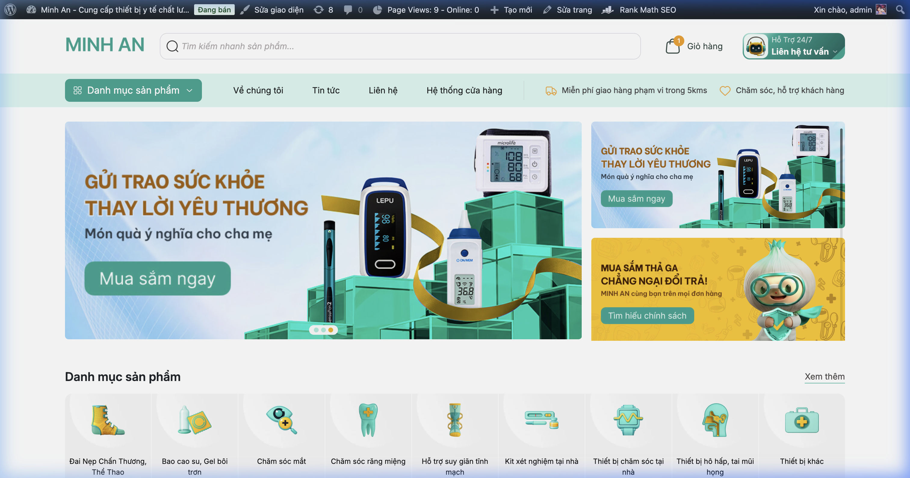

### Mô tả các thành phần

| Thành phần | Mô tả | Vị trí |
|------------|--------|--------|
| **Logo "MINH AN"** | Logo text thương hiệu, góc trái | Header |
| **Thanh tìm kiếm** | Ô tìm kiếm sản phẩm với AJAX gợi ý | Giữa header |
| **Giỏ hàng** | Icon giỏ hàng + số lượng sản phẩm | Góc phải |
| **Hỗ trợ 24/7** | Nút liên hệ tư vấn (chatbot mascot) | Góc phải cùng |
| **Menu danh mục** | Nút dropdown "Danh mục sản phẩm" (xanh) | Thanh navigation |
| **Menu chính** | Về chúng tôi, Tin tức, Liên hệ, Hệ thống | Thanh navigation |
| **Badge ưu đãi** | Miễn phí giao hàng 5km, 100% chính hãng | Thanh navigation |

### Cách chỉnh sửa trong Admin

#### 2.1 Thay đổi Logo
1. Vào **Admin** → `Giao diện` → `Sửa giao diện` (Customize)
2. Tìm mục **Nhận diện trang web** (Site Identity)
3. Upload logo mới tại đây
4. Bấm **Đăng** (Publish) để lưu

> **Lưu ý:** Logo hiện tại là dạng text "MINH AN", được code cứng trong file `header.php` của theme. Để thay đổi, cần chỉnh trực tiếp file theme tại: `wp-content/themes/duanyu/header.php`

#### 2.2 Thay đổi Menu chính
1. Vào **Admin** → `Giao diện` → `Thiết lập Menu`
2. Chọn menu cần chỉnh sửa từ dropdown
3. Thêm/xóa/sắp xếp các mục menu bằng cách kéo thả
4. Bấm **Lưu menu** (Save Menu)

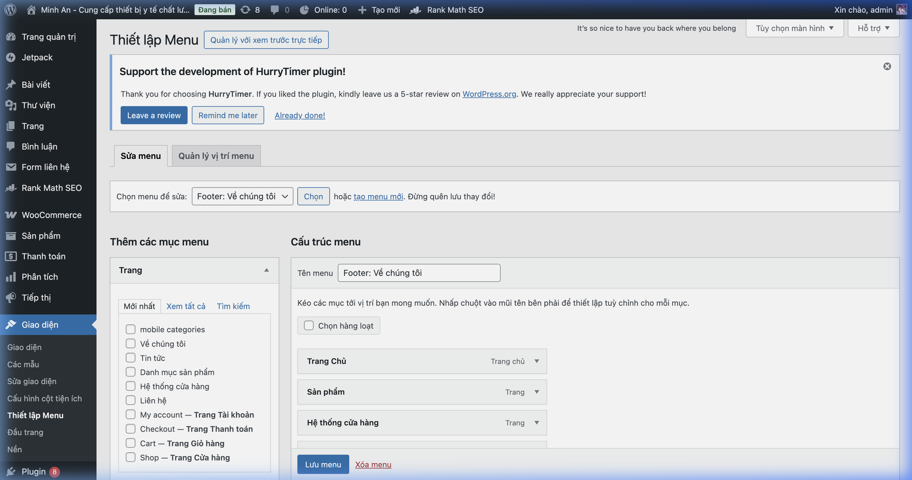

> **Mẹo:** Menu dropdown "Danh mục sản phẩm" được tạo tự động từ danh mục WooCommerce thông qua file `template-parts/mega-menu.php` trong theme.

---

## 3. Trang Chủ - Homepage

### 3.1 Banner Chính (Hero Section)


**Mô tả:**
- **Banner slider bên trái:** Ảnh quảng cáo lớn, có thể trượt qua nhiều slide (hiển thị dots phía dưới)
- **2 Banner phụ bên phải:** Ảnh quảng cáo nhỏ hơn, xếp chồng

**Cách chỉnh sửa:**
1. Vào **Admin** → `Trang` → tìm trang **"home page"** → Click **Sửa**
2. Banner được quản lý thông qua **ACF (Advanced Custom Fields)** - các trường tùy chỉnh trong trang chỉnh sửa
3. Tìm khu vực trường **Banner** trong phần chỉnh sửa trang
4. Upload hình ảnh mới cho từng vị trí banner
5. Bấm **Cập nhật** (Update)

> **⚠️ Quan trọng:** File template của banner nằm tại: `template-parts/home/banners.php`
> Hình ảnh banner được quản lý qua **ACF Pro** (Advanced Custom Fields Pro)

---

### 3.2 Danh Mục Sản Phẩm (Categories Grid)

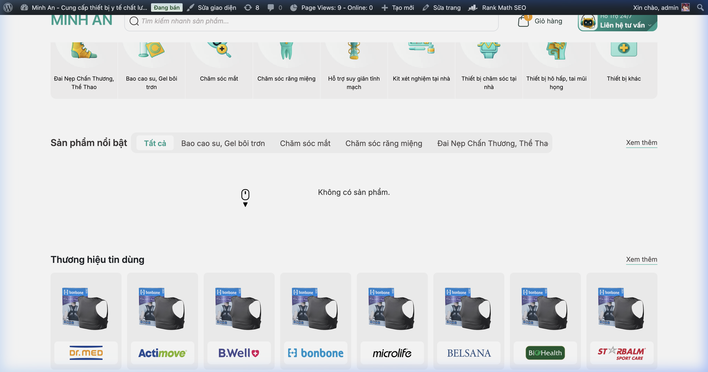

**Mô tả:** Lưới các danh mục sản phẩm với icon minh họa:
- Đai Nẹp Chấn Thương, Thể Thao
- Bao cao su, Gel bôi trơn
- Chăm sóc mắt
- Chăm sóc răng miệng
- Hỗ trợ suy giãn tĩnh mạch
- Kit xét nghiệm tại nhà
- ...và nhiều danh mục khác

**Cách chỉnh sửa:**
1. Vào **Admin** → `Sản phẩm` → `Danh mục`
2. Mỗi danh mục có: Tên, Slug, Mô tả, Hình ảnh đại diện (thumbnail)
3. Click vào tên danh mục để chỉnh sửa
4. Upload hình ảnh đại diện (icon) mới cho danh mục
5. Bấm **Cập nhật**

> **Lưu ý:** File template: `template-parts/home/categories.php`
> Danh mục tự động lấy từ WooCommerce Product Categories

---

### 3.3 Sản Phẩm Nổi Bật (Featured Products)

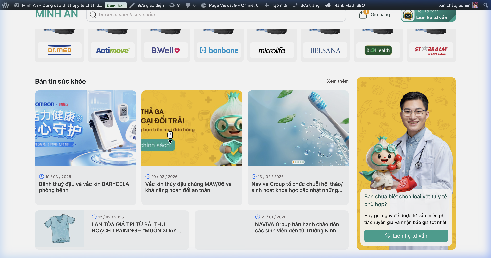

**Mô tả:** Khu vực hiển thị sản phẩm nổi bật theo tab danh mục (Tất cả, Bao cao su, Gel bôi trơn, v.v.)

**Cách chỉnh sửa:**
1. Vào **Admin** → `Sản phẩm` → `Tất cả sản phẩm`
2. Chọn sản phẩm cần gắn "Nổi bật"
3. Bật biểu tượng **ngôi sao** ☆ trong cột sản phẩm
4. Hoặc: Edit sản phẩm → sidebar → check **"Sản phẩm nổi bật"**

> **Lưu ý:** File template: `template-parts/home/highlight.php`
> Các tab danh mục hiển thị sản phẩm nổi bật tương ứng

---

### 3.4 Thương Hiệu Tin Dùng (Brands)

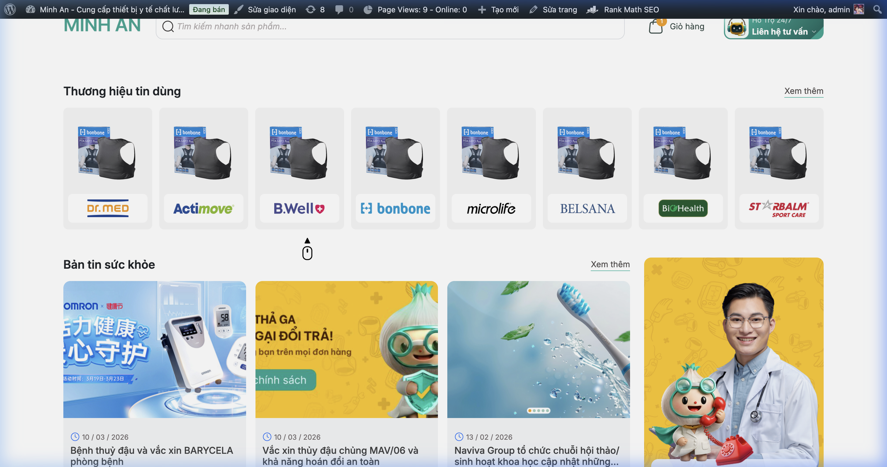

**Mô tả:** Dải logo các thương hiệu: Dr.Med, Actimove, B.Well, Microlife, Belsana...

**Cách chỉnh sửa:**
1. Vào **Admin** → `Sản phẩm` → `Thương hiệu`
2. Thêm/sửa thương hiệu với logo tương ứng
3. Logo thương hiệu được hiển thị tự động trên trang chủ

> **Lưu ý:** File template: `template-parts/home/brand.php`
> Thương hiệu là một taxonomy riêng trong WooCommerce (Custom taxonomy)

---

### 3.5 Bản Tin Sức Khỏe (Health News)

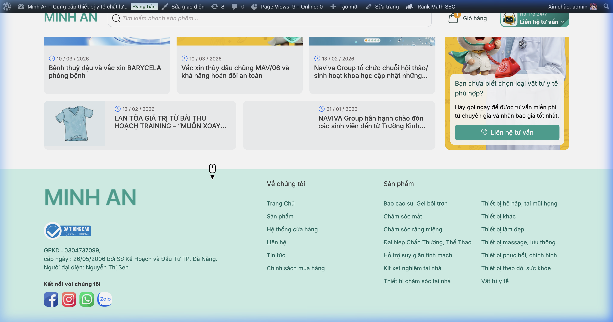

**Mô tả:** Grid các bài viết tin tức/blog mới nhất với thumbnail và tiêu đề

**Cách chỉnh sửa:**
1. Vào **Admin** → `Bài viết` → `Tất cả bài viết`
2. Thêm/sửa bài viết mới
3. Bài viết sẽ tự động hiển thị trên trang chủ (theo thứ tự mới nhất)

> **Lưu ý:** File template: `template-parts/home/news.php`
> Bài viết sử dụng standard WordPress Posts

---

## 4. Trang Sản Phẩm - Shop

### Giao diện Frontend

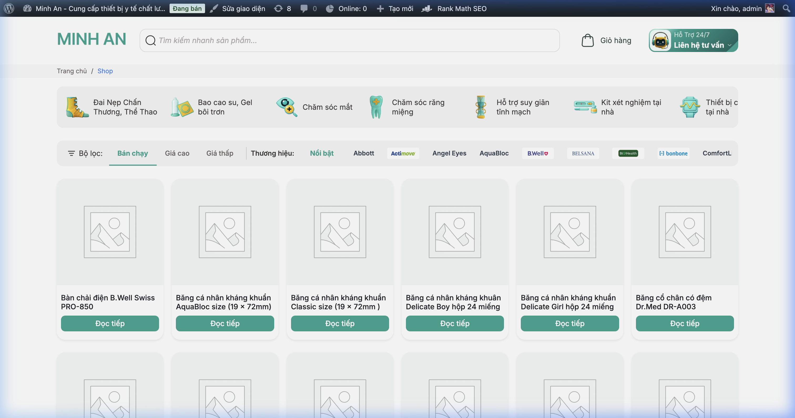

### Mô tả các thành phần

| Thành phần | Mô tả |
|------------|--------|
| **Breadcrumb** | Đường dẫn: Trang chủ > Shop |
| **Thanh danh mục icon** | Các icon danh mục có thể cuộn ngang |
| **Bộ lọc sắp xếp** | Bán chạy, Giá cao, Giá thấp |
| **Bộ lọc thương hiệu** | Abbott, Actimove, Angel Eyes, AquaBloc... |
| **Lưới sản phẩm** | 6 sản phẩm/hàng, ảnh + tên + nút "Đọc tiếp" |
| **Phân trang** | Lên đến 23 trang (333 sản phẩm) |

### Cách chỉnh sửa trong Admin

#### 4.1 Thêm sản phẩm mới
1. Vào **Admin** → `Sản phẩm` → `Thêm sản phẩm mới`
2. Điền thông tin:
   - **Tên sản phẩm**: Tiêu đề hiển thị
   - **Mô tả**: Nội dung chi tiết
   - **Giá bán**: Regular price / Sale price
   - **Hình ảnh**: Upload ảnh sản phẩm
   - **Danh mục**: Chọn danh mục phù hợp
   - **Thương hiệu**: Chọn brand
3. Bấm **Đăng** (Publish)

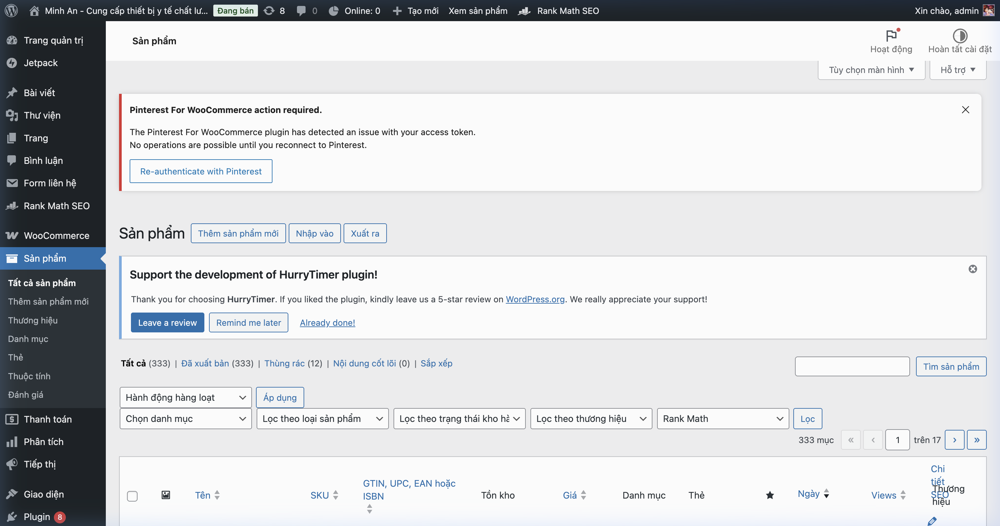

#### 4.2 Quản lý danh mục
1. Vào **Admin** → `Sản phẩm` → `Danh mục`
2. Điền tên danh mục, slug, chọn danh mục cha (nếu có)
3. Upload hình ảnh đại diện
4. Bấm **Thêm danh mục mới**

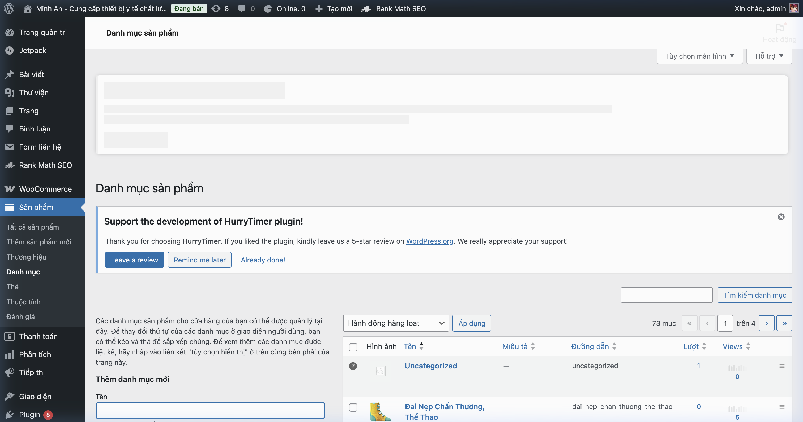

> **Lưu ý:**
> - File template trang Shop: `woocommerce/archive-product.php`
> - File template cho mỗi sản phẩm trong lưới: `woocommerce/content-product.php`

---

## 5. Trang Chi Tiết Sản Phẩm

### Giao diện Frontend

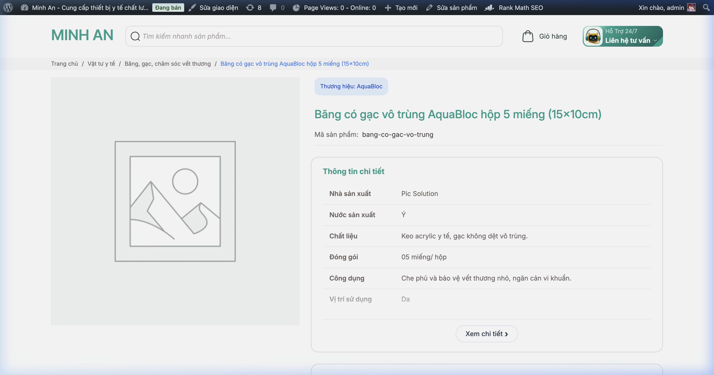

### Mô tả các thành phần

| Thành phần | Mô tả |
|------------|--------|
| **Breadcrumb** | Trang chủ > Danh mục > Tên sản phẩm |
| **Badge Thương hiệu** | Hiển thị brand (VD: AquaBloc) |
| **Tên sản phẩm** | Tiêu đề lớn |
| **Mã sản phẩm (SKU)** | Mã định danh |
| **Ảnh sản phẩm** | Ảnh chính bên trái |
| **Bảng thông tin** | Nhà SX, Nước SX, Chất liệu, Đóng gói, Công dụng... |
| **Nút "Xem chi tiết"** | Mở modal hiển thị thêm thông tin |
| **FAQ** | Câu hỏi thường gặp (accordion) |
| **Sản phẩm nổi bật** | Sản phẩm liên quan |

### Chi tiết FAQ và Modal

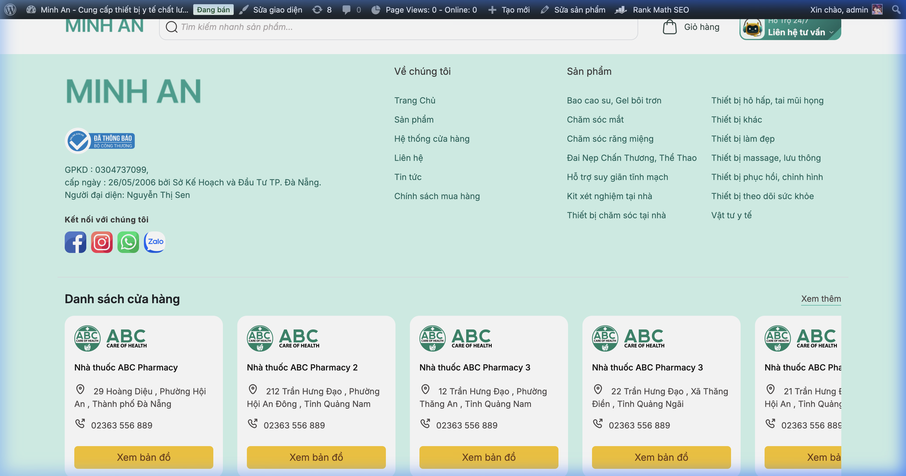

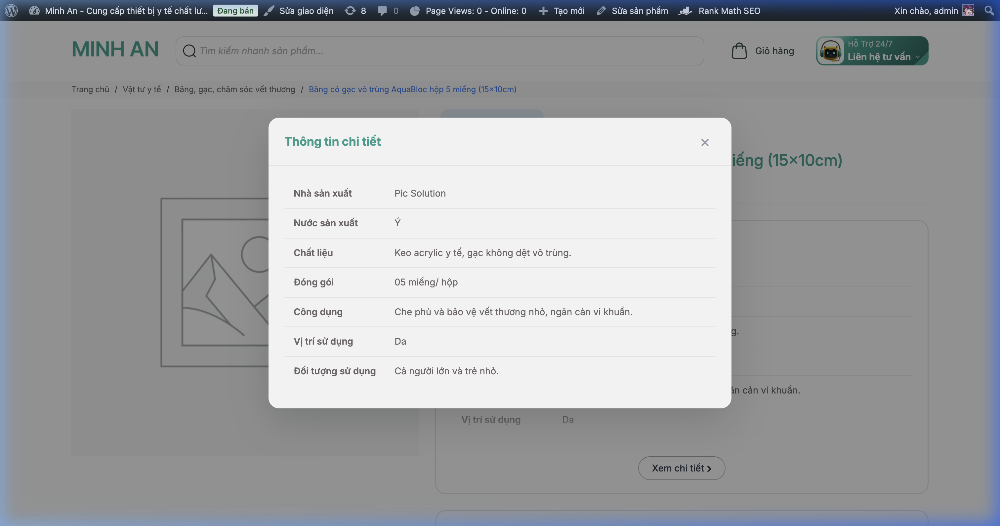

### Cách chỉnh sửa trong Admin

1. Vào **Admin** → `Sản phẩm` → `Tất cả sản phẩm`
2. Click vào tên sản phẩm cần sửa
3. Trong trang chỉnh sửa:

| Mục cần sửa | Vị trí trong Admin |
|-------------|-------------------|
| Tên sản phẩm | Trường tiêu đề phía trên |
| Giá bán | Mục "Dữ liệu sản phẩm" → tab "Cài đặt chung" |
| Hình ảnh | Mục "Hình ảnh sản phẩm" (sidebar phải) |
| Gallery ảnh | Mục "Ảnh Gallery sản phẩm" (sidebar phải) |
| Danh mục | Mục "Danh mục sản phẩm" (sidebar phải) |
| SKU | "Dữ liệu sản phẩm" → tab "Tồn kho" |
| Thông tin chi tiết | **Các trường ACF** phía dưới editor |

> **⚠️ Quan trọng:** Bảng "Thông tin chi tiết" (Nhà sản xuất, Nước sản xuất, Chất liệu...) được quản lý bằng **ACF Pro** (Advanced Custom Fields Pro).
> Các trường này nằm ở cuối trang chỉnh sửa sản phẩm.
> File template: `woocommerce/content-single-product.php`

---

## 6. Trang Giỏ Hàng - Cart

### Giao diện Frontend

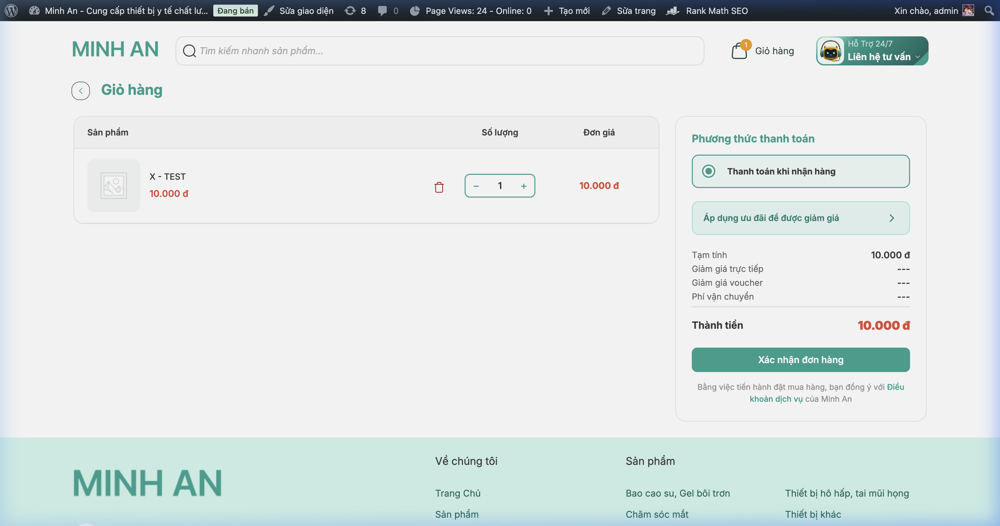

### Mô tả các thành phần

| Thành phần | Mô tả |
|------------|--------|
| **Danh sách sản phẩm** | Bảng: Ảnh, Tên, Giá, Nút xóa |
| **Số lượng** | Bộ đếm với nút `−` / `+` |
| **Đơn giá** | Giá tổng mỗi sản phẩm |
| **Phương thức thanh toán** | Thanh toán khi nhận hàng (COD) |
| **Mã giảm giá** | "Áp dụng ưu đãi để được giảm giá" |
| **Bảng tổng** | Tạm tính, Giảm giá, Phí vận chuyển, Thành tiền |
| **Nút đặt hàng** | "Xác nhận đơn hàng" (xanh lá) |

### Cách chỉnh sửa trong Admin

> **Lưu ý:** Trang giỏ hàng là trang WooCommerce mặc định, được tùy chỉnh giao diện qua theme.

1. **Thay đổi nội dung trang:** `Trang` → `Cart — Trang Giỏ hàng` → Sửa
2. **Thay đổi giao diện:** Chỉnh file theme tại:
   - `woocommerce/cart/cart.php` - Template giỏ hàng
   - `woocommerce/cart/cart-totals.php` - Bảng tổng tiền
3. **Phương thức thanh toán:** `WooCommerce` → `Cài đặt` → tab `Thanh toán`
4. **Mã giảm giá:** `WooCommerce` → `Mã ưu đãi` → Thêm mã mới

---

## 7. Trang Thanh Toán - Checkout

### Giao diện Frontend

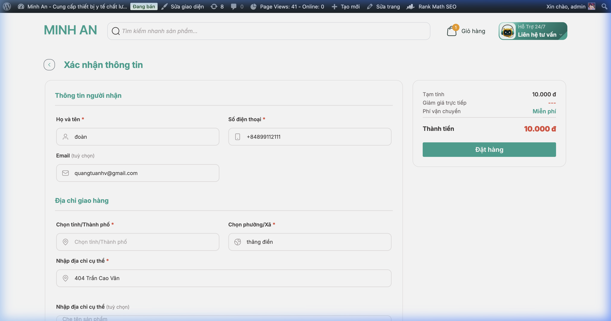

### Mô tả các thành phần

| Thành phần | Mô tả |
|------------|--------|
| **Thông tin người nhận** | Họ tên, Số điện thoại, Email |
| **Địa chỉ giao hàng** | Tỉnh/TP, Phường/Xã, Địa chỉ cụ thể |
| **Tóm tắt đơn hàng** | Sidebar: Tạm tính, Giảm giá, Phí ship, Thành tiền |
| **Nút đặt hàng** | "Đặt hàng" (xanh lá) |

### Cách chỉnh sửa trong Admin

1. **Thay đổi nội dung trang:** `Trang` → `Checkout — Trang Thanh toán` → Sửa
2. **Cấu hình thanh toán:** `WooCommerce` → `Cài đặt` → tab `Thanh toán`
   - Bật/tắt **COD** (Thanh toán khi nhận hàng)
   - Thêm phương thức thanh toán khác (Bank Transfer, PayPal...)
3. **Cấu hình vận chuyển:** `WooCommerce` → `Cài đặt` → tab `Vận chuyển`
   - Thiết lập vùng giao hàng
   - Phí vận chuyển theo khu vực
4. **Template checkout:**
   - `woocommerce/checkout/form-checkout.php`
   - `woocommerce/checkout/review-order.php`

> **💡 Mẹo:** Danh sách Tỉnh/Thành phố và Phường/Xã sử dụng plugin hoặc custom function trong `functions.php` để load dữ liệu hành chính Việt Nam.

---

## 8. Trang Tin Tức - Blog

### 8.1 Trang danh sách tin tức

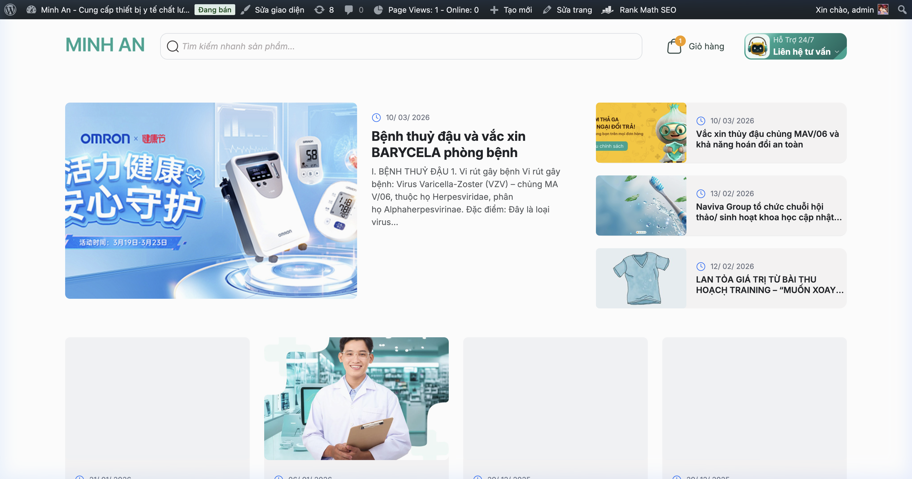

**Mô tả:**
- Bài viết nổi bật lớn ở bên trái (thumbnail + tiêu đề + trích dẫn)
- Danh sách bài viết phụ bên phải (3 bài)
- Grid bài viết tiếp theo bên dưới

### 8.2 Trang chi tiết bài viết

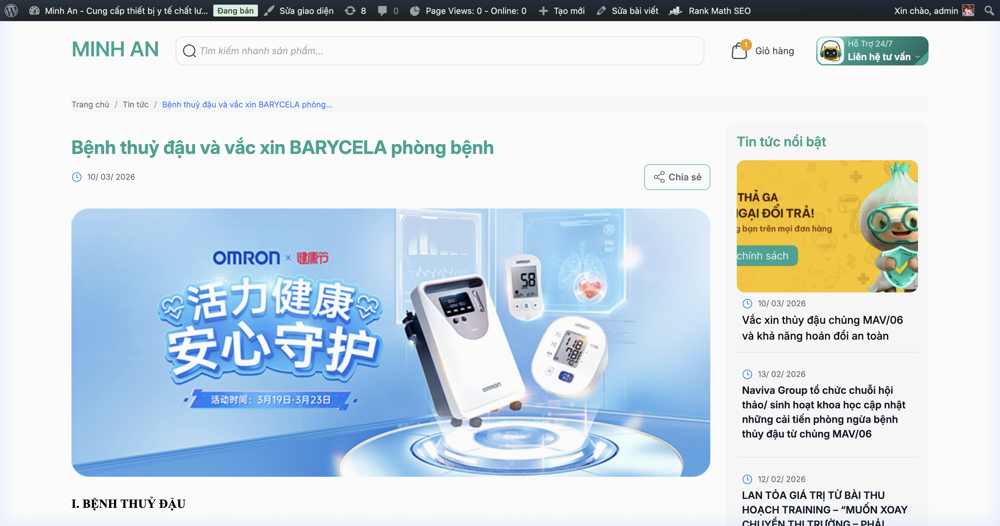

**Mô tả:**
- Breadcrumb (Trang chủ > Tin tức > Tên bài)
- Tiêu đề bài viết
- Ngày đăng + Nút "Chia sẻ"
- Hình ảnh đại diện (Featured image)
- Nội dung bài viết
- **Sidebar phải:** "Tin tức nổi bật" - danh sách bài viết liên quan

### Cách chỉnh sửa trong Admin

#### Thêm/Sửa bài viết
1. Vào **Admin** → `Bài viết` → `Tất cả bài viết`
2. Click **Thêm bài viết** hoặc click vào bài viết cần sửa
3. Trong trang chỉnh sửa:
   - **Tiêu đề**: Nhập tiêu đề bài viết
   - **Nội dung**: Viết/sửa nội dung bằng editor
   - **Hình ảnh đại diện**: Upload tại sidebar phải → "Ảnh đại diện"
   - **Chuyên mục**: Chọn category tại sidebar phải
   - **Thẻ (Tags)**: Thêm tags liên quan
4. Bấm **Đăng** hoặc **Cập nhật**

> **Lưu ý:** File template:
> - Trang danh sách: `templates/page-news.php`
> - Trang chi tiết: `single.php`
> - Category tin tức: `category-tin-tuc.php`

---

## 9. Footer - Chân Trang

### Giao diện Frontend

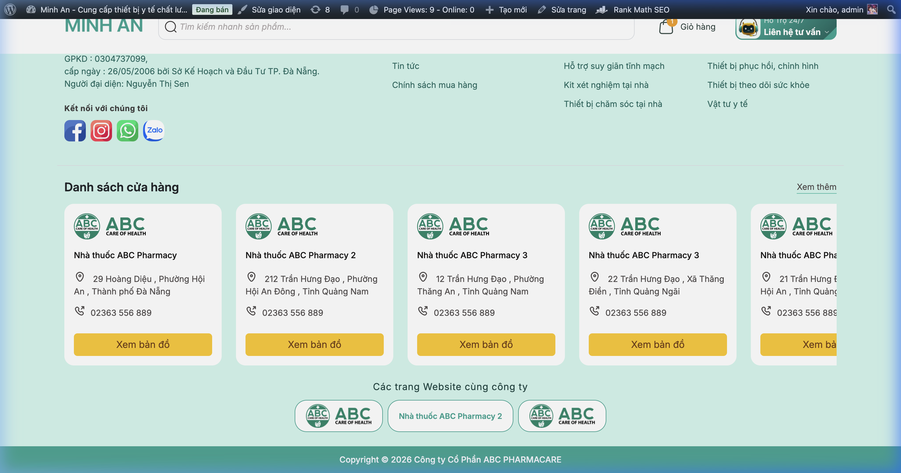

### Mô tả các thành phần

| Thành phần | Mô tả |
|------------|--------|
| **Logo & Thông tin DN** | GPKD, ngày cấp, người đại diện |
| **Social Icons** | Facebook, Instagram, WhatsApp, Zalo |
| **Cột "Về chúng tôi"** | Links: Trang chủ, Sản phẩm |
| **Cột "Tin tức"** | Tin tức, Chính sách mua hàng |
| **Cột "Sản phẩm"** | Danh mục: Bao cao su, Chăm sóc mắt, v.v. |
| **Danh sách cửa hàng** | Carousel các nhà thuốc ABC Pharmacy |
| **Website cùng công ty** | Logo đối tác/công ty thành viên |
| **Copyright** | © 2026 Công ty Cổ Phần ABC PHARMACARE |

### Cách chỉnh sửa trong Admin

#### 9.1 Chỉnh nội dung Footer
> **⚠️ Quan trọng:** Footer được code cứng trong file theme `footer.php`. Để chỉnh sửa nội dung, cần chỉnh trực tiếp file:
> `wp-content/themes/duanyu/footer.php`

#### 9.2 Chỉnh Menu Footer
1. Vào **Admin** → `Giao diện` → `Thiết lập Menu`
2. Chọn menu **"Về chúng tôi"** (Footer menu)
3. Thêm/xóa/sắp xếp items
4. Bấm **Lưu menu**

#### 9.3 Chỉnh Widgets
1. Vào **Admin** → `Giao diện` → `Cấu hình cột tiện ích`
2. Kéo thả widget vào khu vực **"Footer Sidebar"**

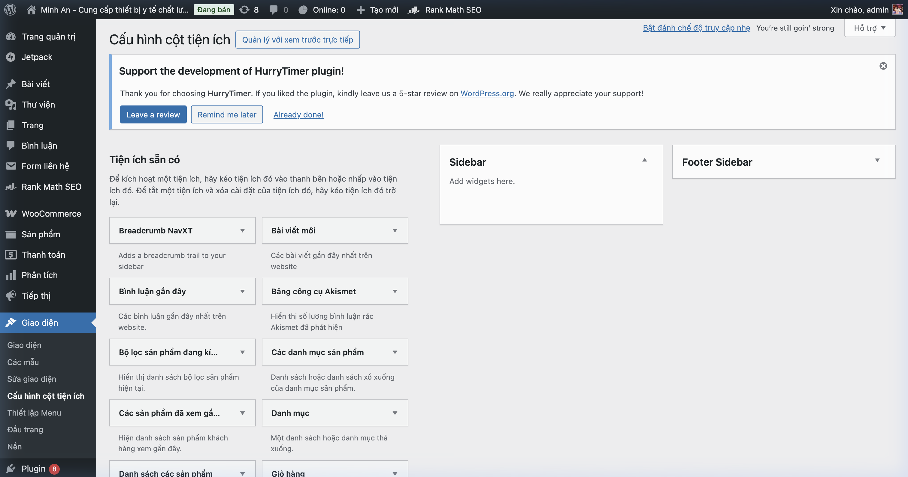

#### 9.4 Danh sách cửa hàng
> **Lưu ý:** Danh sách nhà thuốc (Nhà thuốc ABC Pharmacy) có thể là:
> - **Custom Post Type** "Cửa hàng" (Stores)
> - Hoặc được quản lý qua **ACF** trên trang Hệ thống cửa hàng
>
> Kiểm tra tại: `Trang` → "Hệ thống cửa hàng" → Chỉnh sửa các trường tùy chỉnh ACF

---

## 10. Quản Lý Sản Phẩm

### Danh sách sản phẩm trong Admin


### Cấu trúc quản lý sản phẩm

```
📦 Sản phẩm
├── 📋 Tất cả sản phẩm (333 sản phẩm)
├── ➕ Thêm sản phẩm mới
├── 🏷️ Thương hiệu (Brands)
├── 📂 Danh mục (Categories - 73 danh mục)
├── 🏷️ Thẻ (Tags)
├── 📊 Thuộc tính (Attributes)
└── ⭐ Đánh giá (Reviews)
```

### Hướng dẫn chi tiết

#### 10.1 Thêm sản phẩm mới
1. `Sản phẩm` → `Thêm sản phẩm mới`
2. Điền **Tên sản phẩm**
3. Cuộn xuống mục **"Dữ liệu sản phẩm"**:
   - Tab **Cài đặt chung**: Nhập giá bán (Regular Price) và giá khuyến mãi (Sale Price)
   - Tab **Tồn kho**: Nhập SKU, quản lý kho hàng
   - Tab **Vận chuyển**: Cân nặng, kích thước
4. Phần **ACF custom fields** (phía dưới):
   - Nhà sản xuất
   - Nước sản xuất
   - Chất liệu
   - Đóng gói
   - Công dụng
   - Vị trí sử dụng
   - Đối tượng sử dụng
5. **Sidebar phải**:
   - Chọn Danh mục
   - Chọn Thương hiệu
   - Upload Ảnh sản phẩm
   - Upload Gallery ảnh
6. Bấm **Đăng**

#### 10.2 Sửa sản phẩm
1. `Sản phẩm` → `Tất cả sản phẩm`
2. Di chuột vào tên sản phẩm → Click **Sửa**
3. Chỉnh sửa thông tin cần thiết
4. Bấm **Cập nhật**

#### 10.3 Quản lý Danh mục
1. `Sản phẩm` → `Danh mục`
2. Thêm danh mục mới:
   - Nhập **Tên**
   - Chọn **Danh mục cha** (nếu là danh mục con)
   - Upload **Hình ảnh** đại diện
   - Bấm **Thêm danh mục mới**


#### 10.4 Quản lý Thương hiệu
1. `Sản phẩm` → `Thương hiệu`
2. Tương tự quản lý Danh mục
3. Upload logo thương hiệu

---

## 11. Cài Đặt WooCommerce

### Giao diện Admin

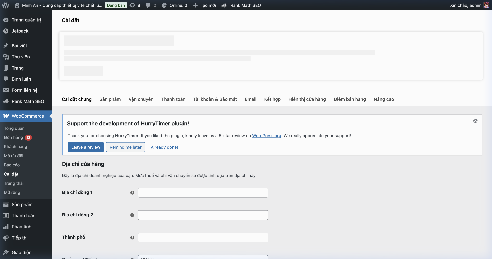

### Các tab cài đặt

| Tab | Nội dung | Đường dẫn |
|-----|----------|-----------|
| **Cài đặt chung** | Địa chỉ cửa hàng, Tiền tệ (VNĐ) | `WooCommerce > Cài đặt > Cài đặt chung` |
| **Sản phẩm** | Hiển thị, Tồn kho, Tải về | `WooCommerce > Cài đặt > Sản phẩm` |
| **Vận chuyển** | Vùng giao hàng, Phí ship | `WooCommerce > Cài đặt > Vận chuyển` |
| **Thanh toán** | COD, Bank Transfer, PayPal | `WooCommerce > Cài đặt > Thanh toán` |
| **Tài khoản & Bảo mật** | Đăng ký, Quyền riêng tư | `WooCommerce > Cài đặt > Tài khoản & Bảo mật` |
| **Email** | Thông báo đơn hàng | `WooCommerce > Cài đặt > Email` |

### Quản lý đơn hàng
1. Vào **Admin** → `WooCommerce` → `Đơn hàng`
2. Xem danh sách đơn hàng mới
3. Click vào đơn hàng để xem chi tiết
4. Cập nhật trạng thái: Chờ xử lý → Đang xử lý → Hoàn thành

### Quản lý mã ưu đãi (Coupon)
1. Vào **Admin** → `WooCommerce` → `Mã ưu đãi`
2. Click **Thêm mã ưu đãi**
3. Nhập mã code, loại giảm giá (% hoặc cố định), giá trị
4. Thiết lập điều kiện (giá trị đơn hàng tối thiểu, sản phẩm áp dụng...)
5. Bấm **Đăng**

---

## 12. Plugin Đang Sử Dụng

| Plugin | Mục đích | Quản lý tại |
|--------|----------|-------------|
| **WooCommerce** | Thương mại điện tử | `WooCommerce > Cài đặt` |
| **ACF Pro** | Trường tùy chỉnh (thông tin SP) | `ACF` menu |
| **Rank Math SEO** | Tối ưu SEO | `Rank Math SEO` |
| **Jetpack** | Bảo mật, Statistics | `Jetpack` |
| **Contact Form 7** | Form liên hệ | `Form liên hệ` |
| **HurryTimer** | Đếm ngược Flash Sale | `HurryTimer` |
| **Breadcrumb NavXT** | Breadcrumb navigation | Tự động |
| **All-in-One WP Migration** | Backup/Restore | `All-in-One WP Migration` |

---

## 📌 Bảng Tóm Tắt: Frontend → Backend Mapping

| Khu vực Frontend | Cách truy cập trong Admin |
|-----------------|--------------------------|
| Logo | Chỉnh file `header.php` hoặc `Giao diện > Customize` |
| Menu chính | `Giao diện > Thiết lập Menu` |
| Banner trang chủ | `Trang > home page > Sửa` (trường ACF) |
| Danh mục sản phẩm | `Sản phẩm > Danh mục` |
| Sản phẩm nổi bật | `Sản phẩm > Tất cả SP` → bật sao ☆ |
| Thương hiệu | `Sản phẩm > Thương hiệu` |
| Bản tin sức khỏe | `Bài viết > Tất cả bài viết` |
| Sản phẩm | `Sản phẩm > Tất cả sản phẩm` |
| Giá sản phẩm | Edit SP → Dữ liệu SP → Cài đặt chung |
| Thông tin chi tiết SP | Edit SP → Trường ACF cuối trang |
| Giỏ hàng | Tự động (WooCommerce template) |
| Thanh toán | `WooCommerce > Cài đặt > Thanh toán` |
| Vận chuyển | `WooCommerce > Cài đặt > Vận chuyển` |
| Mã giảm giá | `WooCommerce > Mã ưu đãi` |
| Đơn hàng | `WooCommerce > Đơn hàng` |
| Footer | Chỉnh file `footer.php` |
| Menu footer | `Giao diện > Thiết lập Menu` |
| SEO | `Rank Math SEO` (mỗi trang/bài) |

---

## 📁 Cấu Trúc File Theme (Tham Khảo Kỹ Thuật)

```
duanyu/
├── header.php              ← Header: logo, menu, search
├── footer.php              ← Footer: thông tin, social, cửa hàng
├── functions.php           ← Logic theme chính
├── style.css               ← CSS giao diện (178KB)
├── single.php              ← Template bài viết đơn
├── page.php                ← Template trang mặc định
│
├── template-parts/
│   ├── home/
│   │   ├── banners.php     ← Banner slider trang chủ
│   │   ├── categories.php  ← Grid danh mục
│   │   ├── highlight.php   ← Sản phẩm nổi bật
│   │   ├── brand.php       ← Thương hiệu tin dùng
│   │   ├── flash-sale.php  ← Sản phẩm flash sale
│   │   ├── consult.php     ← Sản phẩm tư vấn
│   │   └── news.php        ← Bản tin sức khỏe
│   └── mega-menu.php       ← Menu danh mục dropdown
│
├── templates/
│   ├── page-home.php       ← Template trang chủ
│   ├── page-news.php       ← Template trang tin tức
│   ├── page-cart-wc.php    ← Template giỏ hàng
│   ├── page-checkout-wc.php← Template thanh toán
│   ├── page-about.php      ← Template giới thiệu
│   ├── page-contact.php    ← Template liên hệ
│   └── page-partner.php    ← Template đối tác/cửa hàng
│
├── woocommerce/
│   ├── archive-product.php    ← Trang shop (danh sách SP)
│   ├── content-product.php    ← Card sản phẩm trong lưới
│   ├── content-single-product.php ← Chi tiết sản phẩm
│   ├── cart/                  ← Templates giỏ hàng
│   ├── checkout/              ← Templates thanh toán
│   └── single-product/       ← Components sản phẩm đơn
│
└── js/                        ← JavaScript files
```

> **⚠️ Cảnh báo:** Khi chỉnh sửa các file theme (.php, .css, .js), hãy **backup** trước khi thay đổi.
> Nếu website sử dụng child theme, hãy chỉnh sửa trong child theme thay vì theme gốc.
> Hiện tại website đang dùng theme tùy chỉnh "duanyu" nên có thể chỉnh trực tiếp.

---

*Tài liệu này được tạo dựa trên phân tích website Minh An.*
*Cập nhật lần cuối: 15/04/2026*
